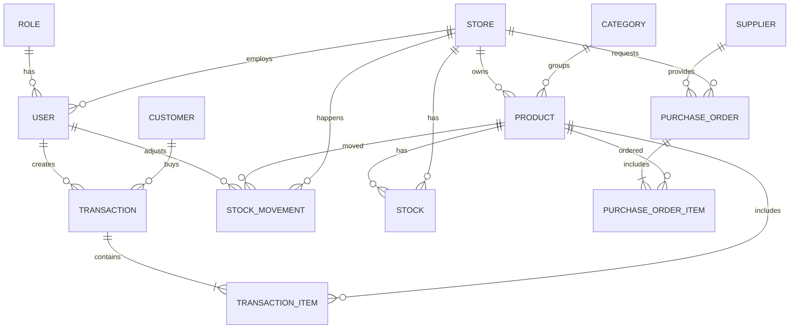

# ERD - Sistem Kasir Multi Toko

## 1. Tujuan

Dokumen ini menjelaskan Entity Relationship Diagram (ERD) untuk sistem kasir dan manajemen stok multi toko. ERD ini menggambarkan struktur database pada level konseptual/logical sebelum diimplementasikan menjadi schema fisik.

## 2. Daftar Entitas Utama (Entities)

- User
- Store (Toko)
- Role
- Product
- Category
- Stock
- Transaction
- Transaction Item
- Customer
- Supplier
- Purchase Order
- Purchase Order Item
- Stock Movement

## 3. Diagram ERD (Level Konseptual)



## 4. DBML Version

Use DBML to define the database structure
Docs: https://dbml.dbdiagram.io/docs

```dbml
Table users {
  id uuid [primary key]
  username varchar [not null]
  password_hash varchar [not null]
  full_name varchar
  email varchar
  phone varchar
  role_id uuid [not null]
  store_id uuid
  status varchar [default: 'active']
  created_at timestamp [default: `now()`]
  updated_at timestamp [default: `now()`]
}

Table stores {
  id uuid [primary key]
  store_name varchar [not null]
  address varchar
  phone varchar
  email varchar
  status varchar [default: 'active']
  created_at timestamp [default: `now()`]
  updated_at timestamp [default: `now()`]
}

Table roles {
  id uuid [primary key]
  role_name varchar [not null]
  description text
  created_at timestamp [default: `now()`]
  updated_at timestamp [default: `now()`]
}

Table categories {
  id uuid [primary key]
  category_name varchar [not null]
  description text
  created_at timestamp [default: `now()`]
  updated_at timestamp [default: `now()`]
}

Table products {
  id uuid [primary key]
  store_id uuid [not null]
  category_id uuid [not null]
  product_name varchar [not null]
  barcode varchar [not null]
  price decimal
  min_stock integer
  status varchar [default: 'active']
  created_at timestamp [default: `now()`]
  updated_at timestamp [default: `now()`]
}

Table stock {
  id uuid [primary key]
  product_id uuid [not null]
  store_id uuid [not null]
  quantity_system integer
  quantity_actual integer
  quantity_actual_check integer
  created_at timestamp [default: `now()`]
  updated_at timestamp [default: `now()`]
}

Table customers {
  id uuid [primary key]
  full_name varchar [not null]
  phone varchar
  email varchar
  created_at timestamp [default: `now()`]
  updated_at timestamp [default: `now()`]
}

Table suppliers {
  id uuid [primary key]
  supplier_name varchar [not null]
  contact_name varchar
  phone varchar
  email varchar
  address varchar
  created_at timestamp [default: `now()`]
  updated_at timestamp [default: `now()`]
}

Table transactions {
  id uuid [primary key]
  user_id uuid [not null]
  store_id uuid [not null]
  customer_id uuid
  transaction_date timestamp [not null]
  total_amount decimal
  payment_method varchar
  invoice_number varchar
  created_at timestamp [default: `now()`]
  updated_at timestamp [default: `now()`]
}

Table transaction_items {
  id uuid [primary key]
  transaction_id uuid [not null]
  product_id uuid [not null]
  quantity integer
  price_per_unit decimal
  subtotal decimal
  created_at timestamp [default: `now()`]
  updated_at timestamp [default: `now()`]
}

Table purchase_orders {
  id uuid [primary key]
  supplier_id uuid [not null]
  store_id uuid [not null]
  order_date timestamp
  total_amount decimal
  status varchar
  created_at timestamp [default: `now()`]
  updated_at timestamp [default: `now()`]
}

Table purchase_order_items {
  id uuid [primary key]
  purchase_order_id uuid [not null]
  product_id uuid [not null]
  quantity integer
  price_per_unit decimal
  subtotal decimal
  created_at timestamp [default: `now()`]
  updated_at timestamp [default: `now()`]
}

Table stock_movements {
  id uuid [primary key]
  product_id uuid [not null]
  store_id uuid [not null]
  movement_type varchar
  quantity integer
  reason text
  created_by uuid [not null]
  movement_date timestamp
  created_at timestamp [default: `now()`]
  updated_at timestamp [default: `now()`]
}

Ref: users.role_id > roles.id
Ref: users.store_id > stores.id
Ref: products.store_id > stores.id
Ref: products.category_id > categories.id
Ref: stock.product_id > products.id
Ref: stock.store_id > stores.id
Ref: transactions.user_id > users.id
Ref: transactions.store_id > stores.id
Ref: transactions.customer_id > customers.id
Ref: transaction_items.transaction_id > transactions.id
Ref: transaction_items.product_id > products.id
Ref: purchase_orders.supplier_id > suppliers.id
Ref: purchase_orders.store_id > stores.id
Ref: purchase_order_items.purchase_order_id > purchase_orders.id
Ref: purchase_order_items.product_id > products.id
Ref: stock_movements.product_id > products.id
Ref: stock_movements.store_id > stores.id
Ref: stock_movements.created_by > users.id

```
