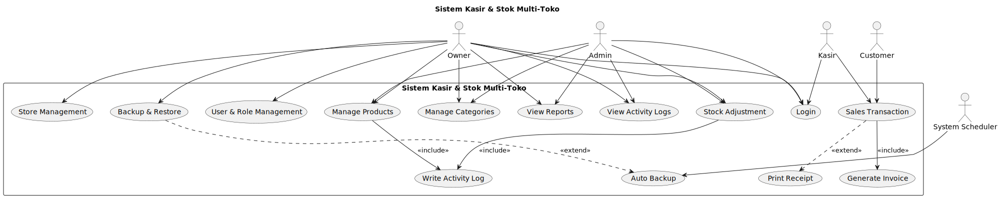

# Use Case - Sistem Kasir & Stok Multi-Toko

## 1. Daftar Aktor

| Aktor      | Deskripsi                                              |
| ---------- | ------------------------------------------------------ |
| **Owner**  | Pemilik sistem, memiliki akses penuh semua toko        |
| **Admin**  | Pengelola toko tertentu (barang, stok, laporan)        |
| **Kasir**  | Melakukan transaksi penjualan                          |
| **System** | Menjalankan proses otomatis (log, backup, autentikasi) |

---

## 2. Daftar Use Case

| No    | Use Case                          | Aktor               |
| ----- | --------------------------------- | ------------------- |
| UC-01 | Login ke sistem                   | Owner, Admin, Kasir |
| UC-02 | Mengelola data barang             | Owner, Admin        |
| UC-03 | Melakukan transaksi penjualan     | Kasir               |
| UC-04 | Melihat laporan penjualan         | Owner, Admin        |
| UC-05 | Mengelola kategori barang         | Owner, Admin        |
| UC-06 | Melakukan update/penyesuaian stok | Owner, Admin        |
| UC-07 | Mengelola user & role             | Owner               |
| UC-08 | Mengelola toko (multi-store)      | Owner               |
| UC-09 | Backup & restore data             | Owner               |
| UC-10 | Melihat activity logs             | Owner, Admin        |

---

## 3. Detail Use Case

### UC-01: Login ke Sistem

**Aktor:** Owner, Admin, Kasir
**Tujuan:** User dapat masuk sistem
**Alur Utama:**

1. User buka halaman login
2. User isi username dan password
3. Sistem verifikasi kredensial
   .Sistem generate JWT token
4. User masuk dashboard

**Alur Alternatif:**

- 3a. Username/password salah → tampil pesan error

---

### UC-02: Mengelola Data Barang

**Aktor:** Owner, Admin
**Tujuan:** Kelola master data barang
**Alur Utama:**

1. User membuka menu Barang
2. User bisa tambah/ubah/hapus data barang
3. Sistem simpan perubahan
   .Sistem catat ke activity log

---

### UC-03: Transaksi Penjualan

**Aktor:** Kasir
**Tujuan:** Input transaksi penjualan
**Alur Utama:**

1. Kasir pilih toko aktif
2. Cari/scan barang
3. Input qty
   .Pilih metode pembayaran
4. Simpan transaksi
5. Cetak struk

**Alur Alternatif:**

- Barang stok habis → sistem tampilkan peringatan

---

### UC-04: Melihat Laporan Penjualan

**Aktor:** Owner, Admin
**Tujuan:** Melihat performa penjualan berdasarkan filter
**Alur Utama:**

1. User buka menu laporan
2. Pilih filter (toko, tanggal, kasir)
3. Sistem menampilkan laporan penjualan
   .User dapat mengekspor laporan (Excel)

---

### UC-05: Mengelola Kategori Barang

**Aktor:** Owner, Admin
**Tujuan:** Mengelola kategori barang untuk mempermudah pengelompokan data
**Alur Utama:**

1. User buka menu kategori barang
2. User tambah/ubah/hapus kategori
3. Sistem menyimpan perubahan
   .Sistem mencatat ke activity log

---

### UC-06: Penyesuaian Stok

**Aktor:** Owner, Admin
**Tujuan:** Melakukan koreksi stok aktual & sistem
**Alur Utama:**

1. User pilih barang
2. Input jumlah selisih stok
3. Tulis alasan penyesuaian
   .Sistem update stok
4. Sistem mencatat ke stock_history & activity_log

---

### UC-07: Manajemen User & Role

**Aktor:** Owner
**Tujuan:** Mengatur user, role, dan akses per toko
**Alur Utama:**

1. Owner buka menu user management
2. Tambah/ubah/hapus user
3. Set role & assign toko
   .Simpan perubahan

---

### UC-08: Manajemen Toko (Multi-Store)

**Aktor:** Owner
**Tujuan:** Menambah atau mengelola cabang toko
**Alur Utama:**

1. Owner buka menu store management
2. Tambah/ubah/hapus toko
3. Simpan

---

### UC-09: Backup & Restore

**Aktor:** Owner
**Tujuan:** Backup database atau restore data backup
**Alur Utama:**

1. Owner buka tools backup
2. Pilih backup atau restore data
3. Simpan ke backup_log

---

### UC-10: Activity Logs

**Aktor:** Owner, Admin
**Tujuan:** Memantau riwayat aktivitas user
**Alur Utama:**

1. Buka menu activity logs
2. Sistem menampilkan log aktivitas (user, aksi, waktu)

---

## 4. Use Case Diagram

### Include / Extend Relationships

- UC-03 **Transaksi Penjualan** <<include>> UC-01 **Login**
- UC-02 **Mengelola Data Barang** <<include>> UC-10 **Activity Logs**
- UC-06 **Penyesuaian Stok** <<include>> UC-10 **Activity Logs**
- UC-03 **Transaksi Penjualan** <<include>> (Generate Invoice)
- UC-03 **Transaksi Penjualan** <<extend>> (Cetak Struk)
- UC-09 **Backup & Restore** <<extend>> (Jadwal Backup Otomatis)

### Diagram

**PlantUML:**
https://www.plantuml.com/sequence

```
@startuml
title Sistem Kasir & Stok Multi-Toko

actor Owner
actor Admin
actor Kasir
actor Customer
actor "System Scheduler" as Scheduler

rectangle "Sistem Kasir & Stok Multi-Toko" {

(Login) as UC_Login

(Manage Products) as UC_ManageProducts
(Manage Categories) as UC_ManageCategories
(Stock Adjustment) as UC_StockAdjust
(Sales Transaction) as UC_Sales
(Generate Invoice) as UC_Invoice
(Print Receipt) as UC_Print
(View Reports) as UC_Reports
(View Activity Logs) as UC_Logs
(Write Activity Log) as UC_WriteLog
(User & Role Management) as UC_UserRole
(Store Management) as UC_Store
(Backup & Restore) as UC_Backup
(Auto Backup) as UC_AutoBackup
}

' Relasi aktor ke use case
Owner --> UC_Login
Admin --> UC_Login
Kasir --> UC_Login
Customer --> UC_Sales

Owner --> UC_ManageProducts
Admin --> UC_ManageProducts
Owner --> UC_ManageCategories
Admin --> UC_ManageCategories

Kasir --> UC_Sales
Owner --> UC_Reports
Admin --> UC_Reports
Owner --> UC_StockAdjust
Admin --> UC_StockAdjust

Owner --> UC_UserRole
Owner --> UC_Store
Owner --> UC_Backup
Scheduler --> UC_AutoBackup

Owner --> UC_Logs
Admin --> UC_Logs

' Include/Extend
UC_Sales --> UC_Invoice : <<include>>
UC_Sales ..> UC_Print : <<extend>>

UC_ManageProducts --> UC_WriteLog : <<include>>
UC_StockAdjust --> UC_WriteLog : <<include>>

UC_Backup ..> UC_AutoBackup : <<extend>>
@enduml
```



## 5. Pre-condition dan Post-condition

### UC-01: Login ke Sistem

**Pre-condition:** User sudah terdaftar dan memiliki akun aktif
**Post-condition:** User mendapatkan JWT token dan session login aktif

### UC-02: Mengelola Data Barang

**Pre-condition:** User memiliki role Owner/Admin dan sudah login
**Post-condition:** Data barang tersimpan/terupdate dan tercatat di activity_log

### UC-03: Transaksi Penjualan

**Pre-condition:** Kasir sudah login dan memilih toko aktif
**Post-condition:** Transaksi tersimpan, stok barang berkurang, invoice dibuat, dan tercatat di stock_history

### UC-04: Melihat Laporan Penjualan

**Pre-condition:** User memiliki hak akses laporan
**Post-condition:** Sistem menampilkan data laporan sesuai filter

### UC-05: Mengelola Kategori Barang

**Pre-condition:** User login sebagai Owner/Admin
**Post-condition:** Data kategori tersimpan/terupdate dan tercatat di activity_log

### UC-06: Penyesuaian Stok

**Pre-condition:** User memiliki akses ke menu stok
**Post-condition:** Stok barang terupdate dan tersimpan di stock_history

### UC-07: Manajemen User & Role

**Pre-condition:** User login sebagai Owner
**Post-condition:** User baru dibuat atau data user diperbarui

### UC-08: Manajemen Toko (Multi-Store)

**Pre-condition:** User login sebagai Owner
**Post-condition:** Data toko tersimpan/terupdate di database

### UC-09: Backup & Restore

**Pre-condition:** Sistem terhubung ke database utama
**Post-condition:** File backup tersimpan atau data berhasil di-restore

### UC-10: Activity Logs

**Pre-condition:** User memiliki hak akses melihat log
**Post-condition:** Log aktivitas ditampilkan sesuai filter
